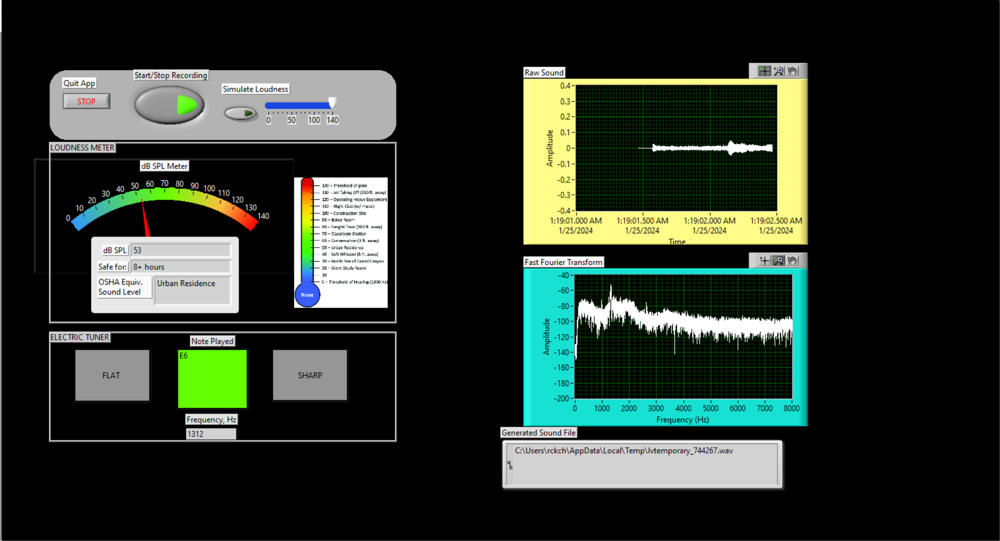

# musical_instrument_design
Designing, building, and testing acoustic musical instruments!
Spring 2024 course at Tufts University, taught by Chris Rogers

**Project 1:** LabVIEW Spectrum Analyzer, with Ethan Goldman, 1 week (see [docs](https://rosekitz.notion.site/LabVIEW-Spectrum-Analyzer-2ef7510fb96545e8af5738736973dc96))

**Project 2:** LabVIEW Timbre Synthesizer, with Jack Goldberg, 1 week (see [docs](https://rosekitz.notion.site/LabVIEW-Synthesizer-bfbf380b23424df68861fbed7e76fd21))

