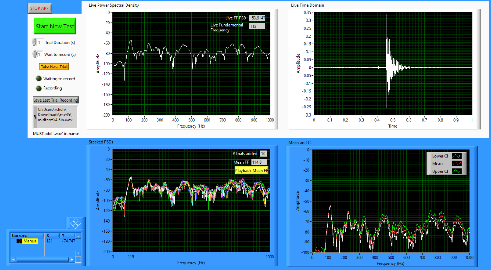
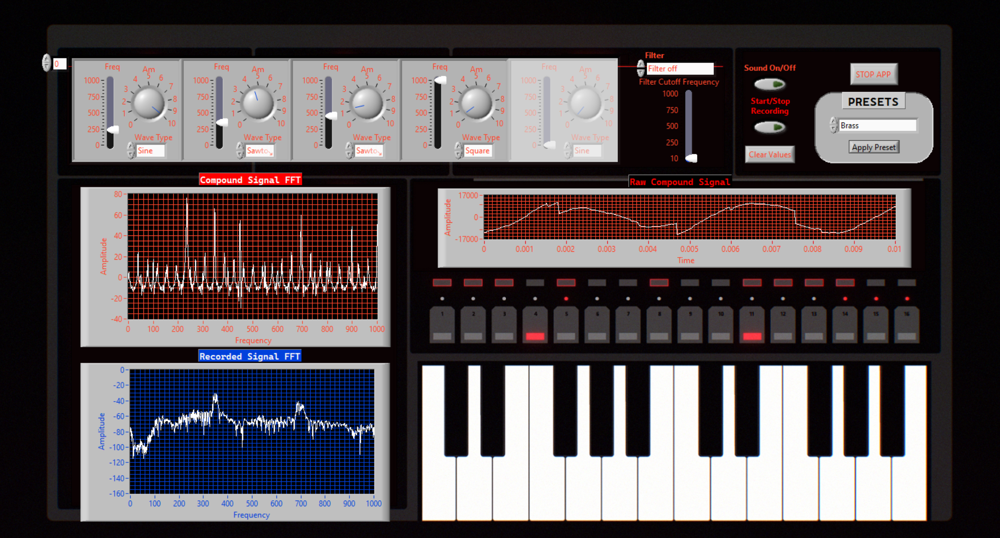

# musical_instrument_design
Designing, building, and testing acoustic musical instruments!
Spring 2024 course at Tufts University, taught by Chris Rogers

| **Midterm:** LabVIEW Testing Spectrum Analyzer (see [docs](https://rosekitz.notion.site/LabVIEW-Spectrum-Analyzer-2ef7510fb96545e8af5738736973dc96)) |  |
| ------------ | ------------ |
|  |  |

| **Project 1:** LabVIEW Spectrum Analyzer (see [docs](https://rosekitz.notion.site/LabVIEW-Spectrum-Analyzer-2ef7510fb96545e8af5738736973dc96)) | **Project 2:** LabVIEW Timbre Synthesizer (see [docs](https://rosekitz.notion.site/LabVIEW-Synthesizer-bfbf380b23424df68861fbed7e76fd21)) |
| ------------ | ------------ |
|  |  |
